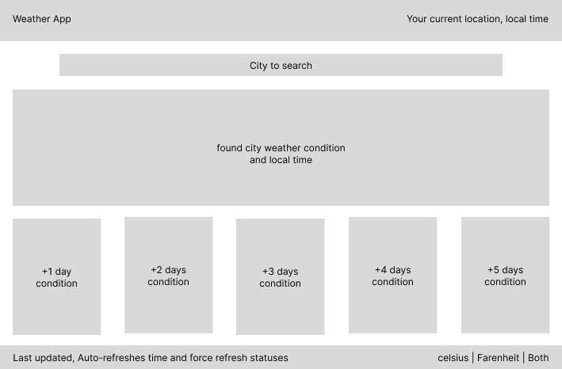
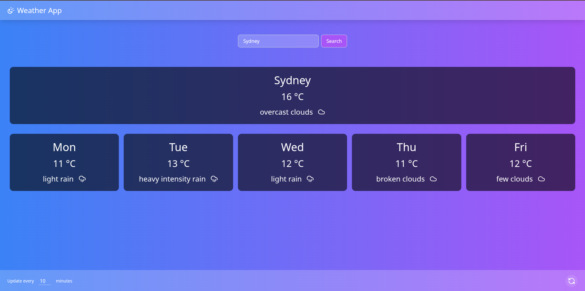

# My Journey solving this code challenge: Weather App

## Acceptance Criteria 
- A user can search for any city and get the weather forecast. 
- In the search result, a user can see the current weather status and the weather for the next 5 days. 
- A polling feature that pings the weather API every 10 minutes for any updates (there may be none), and if there are, reflect those changes on the application.

The above acceptance criteria is the minimum requirement for the challenge. Extra features provided by a bonus point.
  - A user always will see the current local time and the time zone of the searched city.
  - A user can see the weather forecast in Celsius and Fahrenheit.
  - A user can see an image of the searched city reflecting the current weather conditions.
    - The image should be fetched from an external API.
    - The image should be of a turistic place or interesting place in the searched city.

## Main stack
- React (vite-bundler)
- TypeScript
- Node.js (express)

## Testing stack
- Jest

## Bonus stack
- Nx for monorepo management
- Tailwind CSS for styling faster

## How to run the project
1. Clone the repository.
    ```bash
    git clone <repository-url>
    ```
2. Navigate to the project directory.
    ```bash
    cd weather-app
    ```
3. Install dependencies:
   ```bash
   npm install
   ```
4. Start the development server:
   ```bash
   npm run dev
   ```
   this command produces the following output:
   ```bash
    npx nx run-many --target=serve --all=true --parallel=3 --verbose=true
    ```

# Why monorepo?
- Monorepo allows us to manage multiple projects in a single repository, making it easier to share code, manage dependencies, and maintain consistency across projects.
- It simplifies the development process by allowing us to work on multiple applications and libraries simultaneously, reducing the overhead of managing separate repositories.
- It allows running commands across multiple projects, such as building, testing, and serving applications, in a single command.


# Breakdown of the project structure
- `express-server`: Contains the Express server code that serves the API endpoints for fetching weather data and images.
- `react-client`: Contains the React application code that provides the user interface for searching and displaying weather information.
- `shared-lib`: Contains entities and utilities shared between the server and client, such as types and interfaces.

# How to run the tests
1. Navigate to the project directory.
   ```bash
   cd weather-app
   ```
2. Run the tests:
   ```bash
   npm run test
   ```
   this command produces the following output:
   ```bash
   npx nx run-many --target=test --all=true --parallel=3 --verbose=true
   ```

# Planning and Design
- What need to have Visualized :
  - A search input for the user to enter a city name.
  - A display area for the current weather status and the next 5 days forecast.
  - A polling mechanism to update the weather data every 10 minutes (or none).
  - A display area for the current local time and time zone of the searched city. (Bonus)
  - Options to toggle between Celsius and Fahrenheit. (Bonus)
  - An image of a tourist or interesting place in the searched city. (Bonus)
- What need to have Provided by
  - A weather API to fetch current weather data and forecasts. `/api/weather?city={cityName}`
  - An image API to fetch images of the searched city. `/api/image?city={cityName}` (Bonus)
  - A time zone API to fetch the local time and time zone of the searched city. `/api/timezone?city={cityName}` (Bonus)

# Thinking as a UI/UX view
```markdown
---------------------------------------------------------------------------------
| Weather Now                                   Goiânia, GMT-3 🕑 current time  |
---------------------------------------------------------------------------------
| [🔍 Search for a city...]                        [ °C  /  °F / Both Selector ]|
---------------------------------------------------------------------------------
| Sydney, Australia             🕐 21:32  |  GMT+10                             |
| [==== Wide City Photo: Sydney Opera House / Harbour Bridge ====]              |
| "Discover Sydney"                                                             |
---------------------------------------------------------------------------------
| [ ☀️ 18°C ]    Partly Cloudy           Feels like: 17°C                       |
| Humidity: 60%      Wind: 12km/h                                               |
---------------------------------------------------------------------------------
| 5-Day Forecast:                                                               |
| [Wed][🌤️][20°/13°][Sunny]  [Thu][🌧️][18°/12°][Showers]  ... (carousel/grid)   |
---------------------------------------------------------------------------------
| Last updated: 2 mins ago  |  Auto-refreshes every 10 min  |  [🔄 Refresh]     |
---------------------------------------------------------------------------------
```
## mockup


## (TODO) react-client folder structure
```markdown
weather-app/
  └── react-client/
      ├── src/
      │   ├── components/
      │   │   ├── CitySearch
      │   │   ├── WeatherDisplay
      │   │   ├── WeatherForecast
      │   │   ├── TimeZoneDisplay
      │   │   ├── TemperatureToggle
      ├── public/
      │   
```

# Thinking as a server side
```markdown
---------------------------------------------------------------------------------
| Express Server API Endpoints                                                   |
---------------------------------------------------------------------------------
| GET /api/weather?city={cityName}                                               |
|   - Fetches current weather and 5-day forecast for the specified city.          |
|   - Returns JSON response with weather data.                                    |
---------------------------------------------------------------------------------
| GET /api/image?city={cityName}                                                 |
|   - Fetches an image of a tourist or interesting place in the specified city.
|   - Returns JSON response with image URL.                                        |
---------------------------------------------------------------------------------
| GET /api/timezone?city={cityName}                                              |
|   - Fetches the local time and time zone for the specified city.                 |
|   - Returns JSON response with time and timezone data.                           |
---------------------------------------------------------------------------------
| Polling Mechanism                                                              |
|   - Clients can configure to update weather data every 10 minutes or any time.           |
|   - Clients can request the latest data at any time.                             
---------------------------------------------------------------------------------
``` 

## (TODO) express-server folder structure
```markdown
weather-app/
  └── express-server/
      ├── src/
      │   ├── gateways/
      │   └── services/
          └── infra
```

## (TODO) shared-lib folder structure
```markdown
weather-app/
  └── shared-lib/
      ├── src/
      │   ├── entities/
      │   └── utils/
```

# Final thoughts
- This project is a great example of how to build a full-stack application using modern technologies like React, TypeScript, and Node.js.
- The use of monorepo allows for better code organization and management, making it easier to share code between the server and client.
- The project can easily be extended with more features, such as user authentication, saving favorite cities, or integrating with other APIs.
- The use of Tailwind CSS allows for rapid UI development and customization, making it easy to create a visually appealing application.
- The project can be further optimized for performance, such as implementing server-side rendering (SSR) or static site generation (SSG) for the React application.




